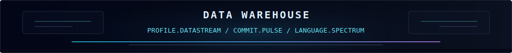

---

### 关于我

- 🌱 正在学习：Rust、TypeScript、AI 应用工程，也持续阅读哲学、社会理论与古典文本。
- 🔭 正在做：个人网站、ShadowMixer、NexusReader，以及一些把想法落成工具的长期实验。
- ✍️ 这里会写：技术实践、项目复盘、阅读摘抄，和关于社会、心理与文化的随笔。
- 💬 可以聊：Web 工程、AI 工具、信息分析、开源项目、写作系统。
- 📫 联系方式：可以通过 GitHub 与我交流。
- 🌐 个人网站：[yubai314.github.io/yubai314](https://yubai314.github.io/yubai314/)

---

   

---

### 技术栈

---

### 贡献记录

<picture>
  <source media="(prefers-color-scheme: dark)"  srcset="https://raw.githubusercontent.com/yubai314/yubai314/output/github-contribution-grid-snake-dark.svg" />
  <source media="(prefers-color-scheme: light)" srcset="https://raw.githubusercontent.com/yubai314/yubai314/output/github-contribution-grid-snake.svg" />
  
</picture>

